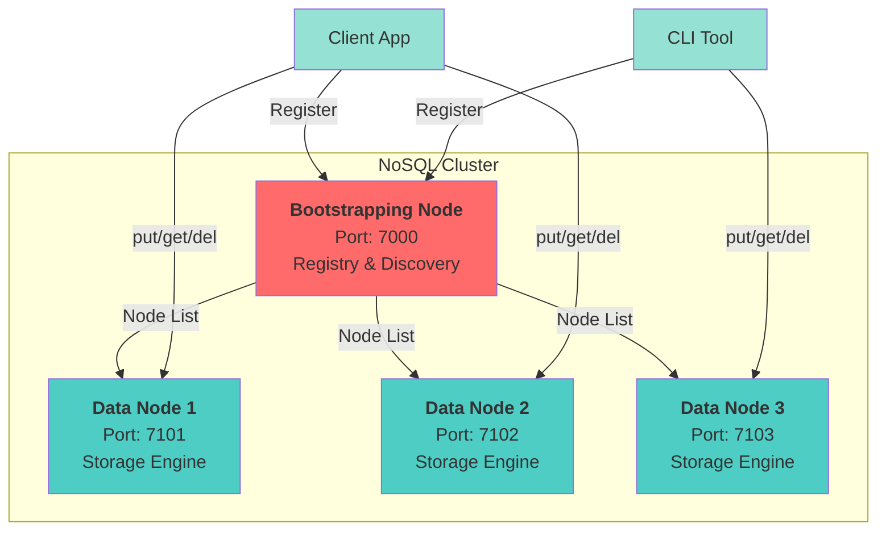
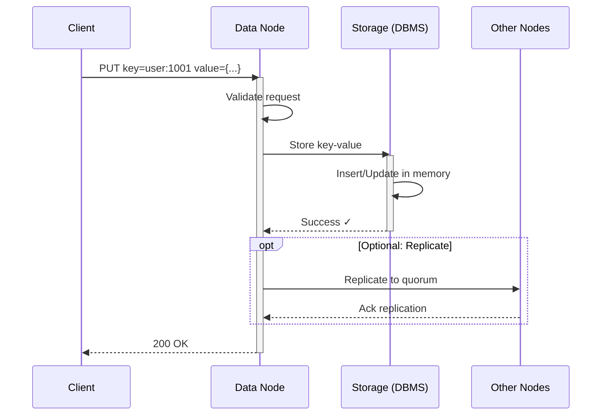
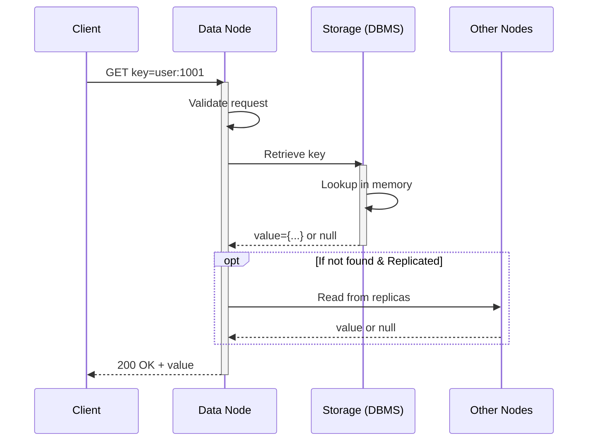
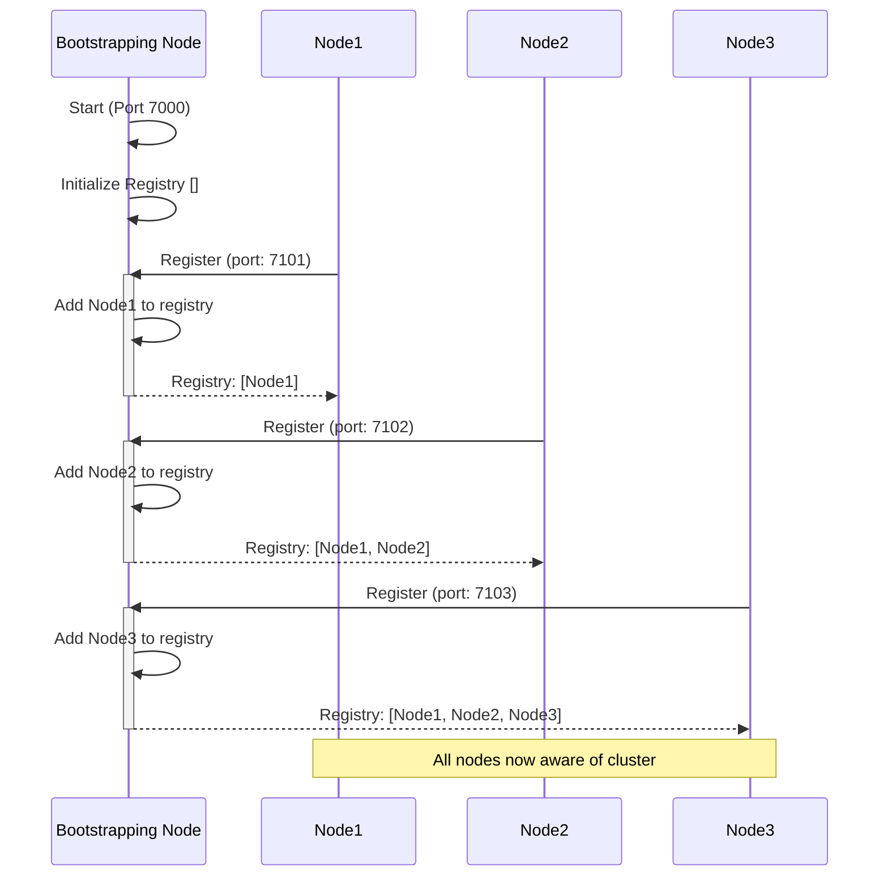

# NoSQL-Database — Decentralized Cluster (Java)

**An educational, modular, and extensible distributed key-value store, built in Java.**

---

## 🚀 Overview

This project is a hands-on implementation of a **decentralized NoSQL key-value database**, inspired by the architecture of systems like **DynamoDB** and **Cassandra**. It is designed primarily for learning and experimentation with distributed systems concepts.

- **Fully modular:** Separated into Bootstrapping, DBMS, and Data Node layers for clean architecture.
- **Cluster formation:** Dynamic node discovery and joining via a bootstrapping registry.
- **Core functions:** Put, get, delete via API or CLI.
- **Extensible architecture:** Ready to add replication, consistent hashing, and eventual consistency.

---

## 📋 What's Inside

✓ **Cluster join via Bootstrapping Node** (central rendezvous at startup)
✓ **Multiple Data Nodes** (run N nodes on different ports)
✓ **Basic key–value operations** (put/get/delete) – depending on your Node API
✓ **Clear module split**: UI-free Java core, simple runnable nodes
✓ **Docs**:
  - `Decentralized Cluster (Haifawi).pdf`
  - `NoSql DB.pdf`

---

## 📄 System Architecture

### High-Level Overview



**Flow (typical):**

1. **BootstrappingNode** starts on port 7000 and exposes a simple registry.
2. **Node** instances start, register with the bootstrapping node, and obtain cluster peer list.
3. **Client** sends operations (`put/get/delete`) to any node; node routes/handles data per your logic.

---

## 🔄 Core Operation: PUT Request Sequence



---

## 🔄 Core Operation: GET Request Sequence



---

## 📋 Cluster Bootstrapping Sequence



---

## 📁 Repository Structure

```
.
├─ BootstrappingNode/       # Service used for node discovery/registration
├─ DBMS/                    # Core database logic (storage/coordination)
├─ Node/                    # Data node service (handles client requests)
├─ Decentralized Cluster (Haifawi).pdf
├─ NoSql DB.pdf
├─ rebuild.sh              # Helper: clean + rebuild project(s)
├─ run.sh                  # Helper: start bootstrapping node + N data nodes
├─ stop.sh                 # Helper: stop running nodes
├─ .gitignore
└─ NoSQL-Databaseb.iml    # IntelliJ project file
```

---

## 🔧 Prerequisites

- **JDK 17+** (`java -version`)
- **IntelliJ IDEA** (recommended) or any Java IDE
- macOS/Linux (for the provided `*.sh` scripts)
  - Windows users: use WSL, Git Bash, or run via IDE

---

## 🚀 Quick Start

### 1) Make scripts executable (first time)

```bash
chmod +x rebuild.sh run.sh stop.sh
```

### 2) Build

```bash
./rebuild.sh
```

### 3) Run (bootstrapping node + a few data nodes)

```bash
./run.sh
```
*Edit the script as needed to change ports or node count.*

### 4) Stop everything

```bash
./stop.sh
```

---

## \u25b6️ Run from IDE (Alternative)

1. **Open** the project in IntelliJ (`File → Open → NoSQL-Database`).
2. Set **Project SDK** to **JDK 17+**.
3. Create run configurations for:
   - **Bootstrapping Node** main class
   - **Data Node** main class (duplicate config per node, with different `--port` / env)
4. Run the **Bootstrapping Node** first, then start **Node** instances.

---

## ⚙️ Configuration

Common items you'll likely want to wire (via args or env):

### Ports
- Bootstrapping node (e.g., `--port=7000`)
- Data nodes (e.g., `--port=7101`, `--port=7102`, ...)

### Bootstrap Endpoint
- Node startup arg: `--bootstrapHost=localhost --bootstrapPort=7000`

### Storage Path (if you use filesystem)
- `--dataDir=/tmp/node-7101`

### Cluster Options (optional/future)
- `--replicationFactor=3`
- `--hashRing=consistent`

> Document your actual flags as you finalize your `main` classes.

---

## 🔌 API Documentation

### HTTP Endpoints (if implemented)

| Method | Endpoint          | Description       |
|--------|-------------------|-------------------|
| PUT    | `/kv/{key}`       | Store a value     |
| GET    | `/kv/{key}`       | Retrieve value    |
| DELETE | `/kv/{key}`       | Delete value      |
| GET    | `/cluster/nodes`  | List of nodes     |
| POST   | `/cluster/join`   | Join the cluster  |

### CLI Usage (example)

```bash
java -jar node.jar put user:1001 '{"name":"Marya"}'
java -jar node.jar get user:1001
java -jar node.jar del user:1001
```

---

## 🔤 Testing (Suggested)

- **Unit tests** for storage layer (put/get/delete, overwrite, delete non-existent)
- **Concurrency tests** (parallel puts/gets on same key range)
- **Multi-node tests** (start 3 nodes; verify distribution and basic fail behavior)
- **Serialization** (if you gossip/handshake, test payloads)

---

## 🚧 Troubleshooting

| Issue | Solution |
|-------|----------|
| Port already in use | Change ports in `run.sh` or your run configs |
| Nodes can't join cluster | Confirm bootstrap host/port and that BootstrappingNode is up |
| Data not persisted | Verify you're using the intended storage path or in-memory map |
| Windows script issues | Run in WSL/Git Bash or use IDE run configs |

---

## 🖺 Roadmap (Nice-to-have)

- [ ] Consistent hashing ring + virtual nodes
- [ ] Replication factor (R) with quorum (`R/W`) and simple read-repair
- [ ] Gossip-based membership (failure detection)
- [ ] Snapshot/compaction for on-disk engine
- [ ] Basic metrics (`/health`, `/metrics`)

---

## 🤝 Contributing

- Keep modules cohesive (Bootstrapping vs Node vs DBMS).
- Favor **clean interfaces** (`Storage`, `Membership`, `Router`) and **unit tests** per module.
- Small, focused PRs with clear test coverage.

---

## 📚 Resources

- [Decentralized Cluster (Haifawi).pdf](./Decentralized%20Cluster%20(Haifawi).pdf)
- [NoSql DB.pdf](./NoSql%20DB.pdf)

For theory and design, consult included PDFs or contact the maintainer for guidance.

---

**Happy hacking!🚀**
