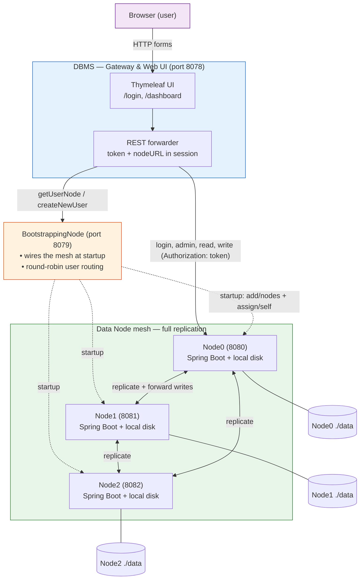
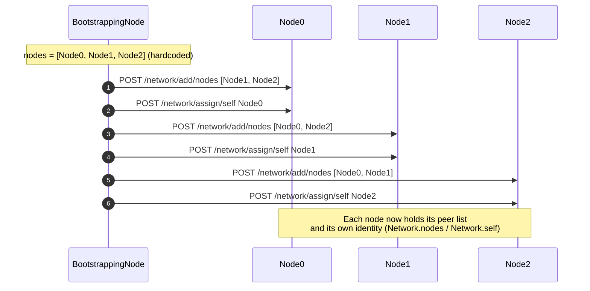
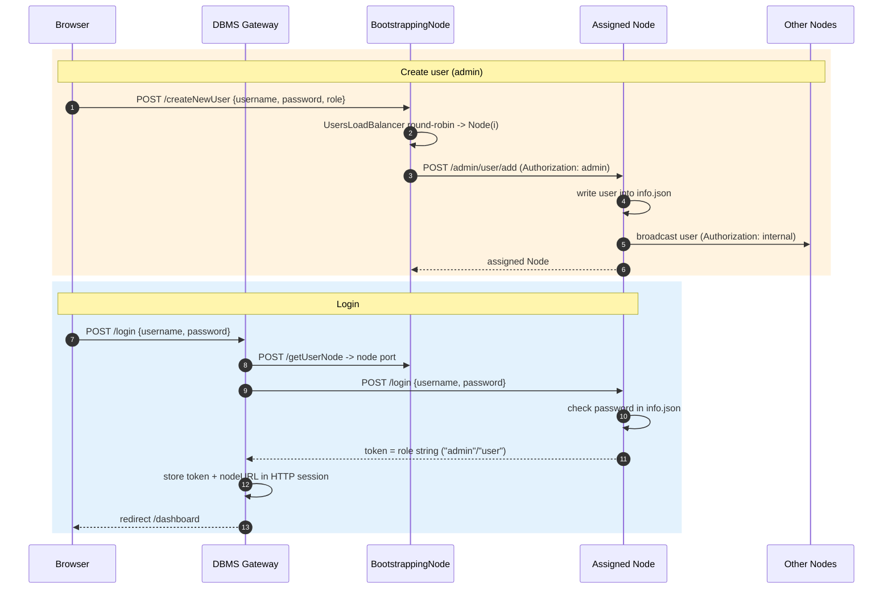
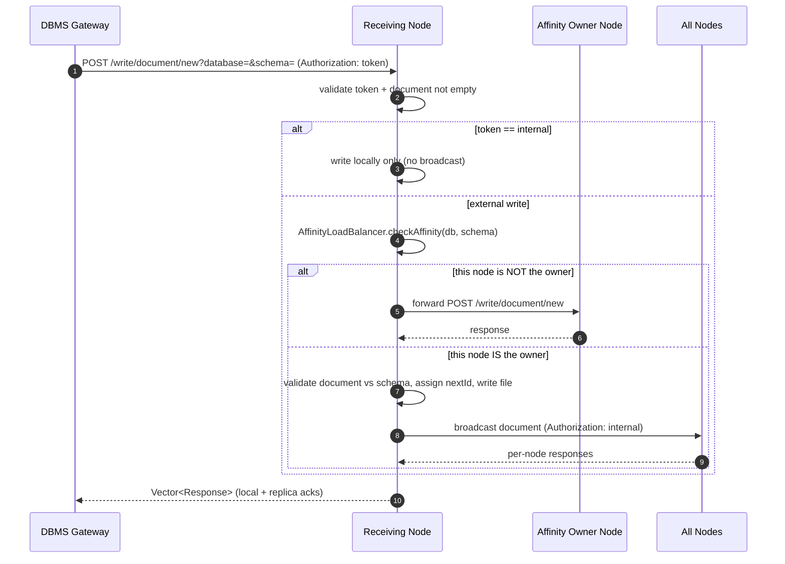
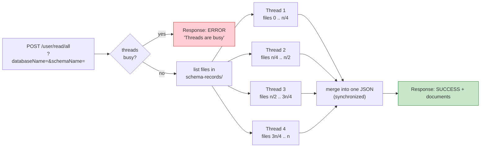
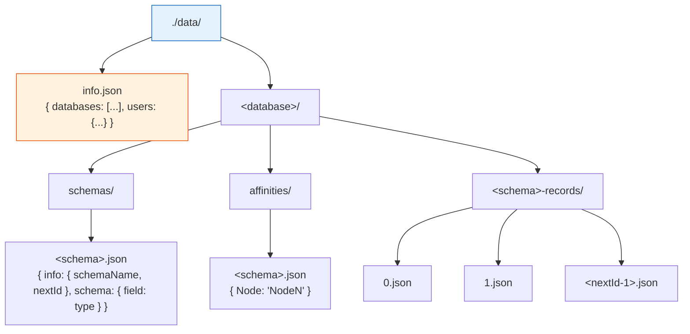

# NoSQL-Database — Decentralized Document Store (Java / Spring Boot)

A schema-enforced, **document-oriented NoSQL database** that runs as a small cluster of independent Java services. Data is stored as JSON files on each node's local disk, users are sharded across nodes, and every write is replicated to the whole cluster.

> This project was built for learning distributed-systems and DBMS internals. The README below describes **what the code actually does today**, including the parts that are scaffolded but not yet wired in.

---

## Table of Contents

- [Architecture at a glance](#architecture-at-a-glance)
- [The three modules](#the-three-modules)
- [System architecture (diagram)](#system-architecture-diagram)
- [How the cluster forms (bootstrapping)](#how-the-cluster-forms-bootstrapping)
- [User routing & login](#user-routing--login)
- [Writing a document (affinity + replication)](#writing-a-document-affinity--replication)
- [Reading documents (parallel read)](#reading-documents-parallel-read)
- [On-disk storage layout](#on-disk-storage-layout)
- [Data model & validation](#data-model--validation)
- [Ports](#ports)
- [HTTP API reference](#http-api-reference)
- [Build & run](#build--run)
- [Repository structure](#repository-structure)
- [Implemented vs. scaffolded](#implemented-vs-scaffolded)
- [Documentation](#documentation)

---

## Architecture at a glance

The system is **three separate Spring Boot applications** (Java 17, Spring Boot 2.7.6):

| Module | Role | Talks to |
|--------|------|----------|
| **DBMS** | Client-facing gateway + Thymeleaf web UI (login/dashboard). Holds no data. | BootstrappingNode + Data Nodes (via REST) |
| **BootstrappingNode** | Cluster coordinator: wires the node mesh at startup and routes users to nodes (round-robin). | Data Nodes (via REST) |
| **Node** | The actual data node / storage engine. Stores JSON on local disk, authenticates users, replicates writes. | Every other Node in the mesh |

Key properties, as implemented:

- **Document store, not a plain key-value store.** Data is organized as `database → schema → document`, and documents are validated against a typed schema before they are stored.
- **Full replication.** Databases, users, schemas, and documents are broadcast to **every** node, so each node holds a complete copy of the data.
- **Two forms of sharding.** *Users* are distributed round-robin across nodes by the BootstrappingNode; each *schema* is assigned an "affinity" (owner) node that coordinates its document writes.
- **Static membership.** The cluster is a fixed, fully-connected **3-node mesh** (`Node0`, `Node1`, `Node2`) wired up by the BootstrappingNode at startup — there is no dynamic discovery or failure detection.
- **File-based auth.** Users live in `info.json`; passwords are compared in plaintext; the "token" returned on login is simply the user's role string (`admin` / `user`).

---

## The three modules

### DBMS — gateway & web UI
A Spring MVC app (Thymeleaf) that a human uses through the browser. It stores **no data**. On login it asks the BootstrappingNode which node owns the user, authenticates against that node, and keeps the returned token + node URL in the HTTP session. Every subsequent admin/read/write action is forwarded to that node's REST API with the token in the `Authorization` header.

Controllers: `LoginController`, `DashboardController`, `AdminController` (`/admin/*`), `WriteController`.

### BootstrappingNode — coordinator & user router
On startup (`CommandLineRunner`) it builds the mesh: for each of the three nodes it POSTs the *other* two to `/network/add/nodes` and POSTs the node itself to `/network/assign/self`. It also creates users (round-robin placement via `UsersLoadBalancer`, replicated by the target node) and answers "which node owns this user?" queries.

### Node — data node / storage engine
Each node is autonomous and holds a full copy of the data on its local filesystem. Responsibilities:

- **Storage** as JSON files under `./data/` (`FileReader` / `FileWriter` / `FileUpdater`, `DirectoryManager`).
- **Authentication** against `info.json`; role-string tokens (`internal` / `admin` / `user`).
- **Schema affinity & write coordination** (`AffinityLoadBalancer`): if a node receives a document write for a schema it doesn't own, it forwards the write to the owner; the owner writes locally and broadcasts to the mesh.
- **Replication** of databases, users, schemas, and documents to all peers via thread-pool broadcasts. An `internal` token prevents re-broadcast loops.
- **Parallel reads**: `read/all` fans a schema's documents across 4 threads.
- **Validation** of schema field types and of documents against their schema.

---

## System architecture (diagram)



The DBMS forwards user-facing traffic to **one** node (the user's assigned node); that node handles the operation and, for writes, propagates it to the rest of the mesh.

---

## How the cluster forms (bootstrapping)

Membership is not discovered — it is configured. At startup the BootstrappingNode has a hardcoded list of three nodes and turns them into a fully-connected mesh where each node knows the other two and its own identity.



Each node keeps its peer list and identity in a static in-memory `Network` (`nodes`, `self`). There is no heartbeat or re-join logic; if a node is down at startup, the corresponding call simply fails silently.

---

## User routing & login

Users are **sharded** across nodes. The BootstrappingNode assigns each new user to a node round-robin, and the node replicates the user record to the whole mesh so any node can later authenticate it. The DBMS asks the BootstrappingNode which node a returning user belongs to, then logs in against that node.



> Note on tokens: the "token" is not a signed JWT — it is literally the user's role string. `Token.INTERNAL` (`internal`) is a reserved value used for node-to-node calls to prevent re-broadcast loops.

---

## Writing a document (affinity + replication)

Each schema has an **affinity node** — the node responsible for coordinating writes to that schema, chosen round-robin when the schema is created. When any node receives a document write, it checks the schema's affinity file. If it is not the owner, it forwards the write to the owner. The owner writes locally, then broadcasts the document to every node so all copies stay in sync.



Schema and database creation follow the same broadcast pattern: the receiving node applies the change locally, then propagates it to all peers using a 4-thread pool. `synchronized` blocks guard the file writes on each node.

Document IDs are sequential integers per schema, tracked by a `nextId` counter stored in the schema file.

---

## Reading documents (parallel read)

Reads are served from the local disk of the node handling the request. `read/all` splits the schema's document files into four contiguous ranges and reads them concurrently with four threads.



`read/document` (by id) is a simple single-file read. Both endpoints require a valid user token.

---

## On-disk storage layout

Every node stores its full copy of the data under `./data/` (see `PathBuilder`). `info.json` holds the registry of databases and users; each database has `schemas/`, per-schema record folders, and `affinities/`.



Concrete paths:

```
./data/info.json                              # databases list + users
./data/<database>/schemas/<schema>.json       # schema definition + nextId
./data/<database>/affinities/<schema>.json    # which node owns this schema
./data/<database>/<schema>-records/<id>.json  # one document per file
```

---

## Data model & validation

A **schema** maps field names to types, restricted to `String`, `Integer`, `Double`, `Boolean` (`Validators.validateSchema`). A **document** is validated against its schema before it is written (`Validators.validateDocument`): every schema field must be present, non-null, and of the matching Java type.

Example schema definition:

```json
{
  "info":   { "schemaName": "users", "nextId": 3 },
  "schema": { "Name": "String", "Age": "Integer", "Active": "Boolean" }
}
```

Example stored document (`2.json`):

```json
{ "Name": "Marya", "Age": 27, "Active": true }
```

---

## Ports

Ports come from the code and container scripts, not the (inconsistent) `application.properties` files:

| Service | Port | Source |
|---------|------|--------|
| DBMS (gateway/UI) | **8078** | `DbmsApplication` `WebServerFactoryCustomizer` |
| BootstrappingNode | **8079** | `run.sh` (`-p 8079:8080`); DBMS calls `http://localhost:8079` |
| Data nodes | **8080, 8081, 8082, …** | `run.sh` (`-p 808$i:8080`) |

Inside the Docker network, nodes address each other by container name (`Node0`, `Node1`, `Node2`) on port `8080`. When running outside Docker, the DBMS addresses nodes at `http://localhost:<port>`.

---

## HTTP API reference

### DBMS gateway (browser-facing, port 8078)

| Method | Path | Purpose |
|--------|------|---------|
| GET | `/login` | Login page |
| POST | `/login` | Authenticate; stores token + nodeURL in session |
| GET | `/dashboard` | Dashboard (create DB, add user, create schema) |
| POST | `/admin/createDatabase` | Create a database (forwarded to user's node) |
| POST | `/admin/addUser` | Add a user (forwarded to user's node) |
| POST | `/createSchema` | Create a schema (forwarded to user's node) |

### BootstrappingNode (port 8079)

| Method | Path | Purpose |
|--------|------|---------|
| POST | `/createNewUser` | Round-robin place a new user on a node, then replicate |
| POST | `/getUserNode` | Return the port of the user's assigned node |
| GET | `/test` | Health check |

### Data Node (port 8080+)

| Method | Path | Purpose |
|--------|------|---------|
| POST | `/login` | Authenticate against `info.json`; returns role token |
| POST | `/admin/user/add` | Add user locally; broadcast if caller is admin |
| POST | `/admin/database/create?databaseName=` | Create database locally; broadcast if admin |
| POST | `/write/schema/new?database=` | Assign affinity, create schema, broadcast |
| POST | `/write/document/new?database=&schema=` | Affinity-route, write, broadcast |
| POST | `/user/read/document?id=&databaseName=&schemaName=` | Read one document by id |
| POST | `/user/read/all?databaseName=&schemaName=` | Read all documents (4 threads) |
| POST | `/network/add/node` | Add a single peer |
| POST | `/network/add/nodes` | Set the peer list |
| POST | `/network/assign/self` | Set this node's identity |
| GET | `/network/get/nodes` | List peers |
| GET | `/user/network/get/self` | Return this node's identity |
| ANY | `/test`, `/test/broadcast` | Diagnostics |

All node data endpoints require an `Authorization` header carrying a role token (`admin`, `user`, or `internal`).

---

## Build & run

**Prerequisites:** JDK 17, Maven (wrappers `mvnw` are included), and Docker (for the provided scripts).

### With Docker (provided scripts)

The scripts build the `Node` image, create a bridge network, and start N data nodes plus the BootstrappingNode.

```bash
# 1) Build the Node module and its Docker image
./rebuild.sh

# 2) Start the cluster (prompts for the number of data nodes; use 3 to match the mesh)
./run.sh

# 3) Tear everything down
./stop.sh
```

> The BootstrappingNode wires exactly three nodes (`Node0`, `Node1`, `Node2`). Start **3** data nodes so the mesh matches. The `rebuild.sh` script currently builds only the `Node` image; build and run the `BootstrappingNode` and `DBMS` images (or run them from your IDE) as well.

### From an IDE / command line

Each module is an independent Spring Boot app. Start them in this order:

```bash
# Data nodes (run three instances; override the port per instance)
cd Node && ./mvnw spring-boot:run

# Coordinator
cd BootstrappingNode && ./mvnw spring-boot:run

# Gateway + UI, then open http://localhost:8078/login
cd DBMS && ./mvnw spring-boot:run
```

Because the BootstrappingNode addresses nodes as `Node0/Node1/Node2:8080` and the DBMS addresses them as `localhost:<port>`, running fully outside Docker requires matching those hostnames/ports to your setup.

---

## Repository structure

```
.
├─ BootstrappingNode/     # Coordinator: mesh setup + round-robin user routing
│  └─ src/main/java/.../  # BootstrappingNodeApplication, UserController, UsersLoadBalancer, models
├─ DBMS/                  # Gateway + Thymeleaf UI (login/dashboard); holds no data
│  └─ src/main/
│     ├─ java/.../        # controllers, services, database_system (connection/read/write/admin)
│     └─ resources/templates/  # login.html, dashboard.html
├─ Node/                  # Data node / storage engine
│  └─ src/main/java/.../
│     ├─ controllers/     # network, admin, authentication, read, write, test
│     ├─ services/        # admin, authentication (+ RSAEncryption), read (+ indexing), write
│     ├─ operations/      # admin & write file operations
│     ├─ model/           # Node, Network, User
│     └─ utils/           # AffinityLoadBalancer, PathBuilder, Token, Validators,
│                         #   cache/ (LRU scaffold), directory/, file_operations/, response/
├─ rebuild.sh             # Build Node module + Docker image
├─ run.sh                 # Create network + start N nodes + BootstrappingNode
├─ stop.sh                # Remove containers + network
├─ Decentralized Cluster (Haifawi).pdf
└─ NoSql DB.pdf
```

---

## Implemented vs. scaffolded

To keep this honest, here is what exists in the codebase but is **not yet functional**:

| Component | Status |
|-----------|--------|
| Document store, schema validation, typed fields | ✅ Implemented |
| Static 3-node mesh + startup wiring | ✅ Implemented |
| User sharding (round-robin) + login routing | ✅ Implemented |
| Full replication of DBs, users, schemas, documents | ✅ Implemented |
| Schema affinity + write forwarding | ✅ Implemented |
| Parallel `read/all` (4 threads) | ✅ Implemented |
| **LRU cache** (`Cache`, `DoubleLinkedList`) | ⚠️ Scaffolded — `add/get/remove/clear` are empty stubs; injected but unused |
| **IndexingService** | ⚠️ Empty class |
| **`RSAEncryption`** | ⚠️ Present but not wired into any request flow (and uses a symmetric key, not RSA) |
| **Spring Security / JWT filter** | ⚠️ Commented out in `NodeApplication`; tokens are plain role strings |
| Dynamic discovery / failure detection / quorum | ❌ Not present (membership is static) |

---

## Documentation

Design write-ups included in the repo:

- [Decentralized Cluster (Haifawi).pdf](./Decentralized%20Cluster%20(Haifawi).pdf)
- [NoSql DB.pdf](./NoSql%20DB.pdf)****
